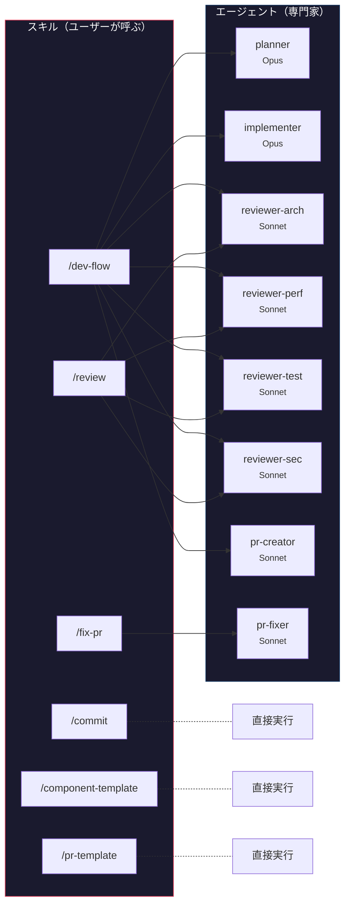
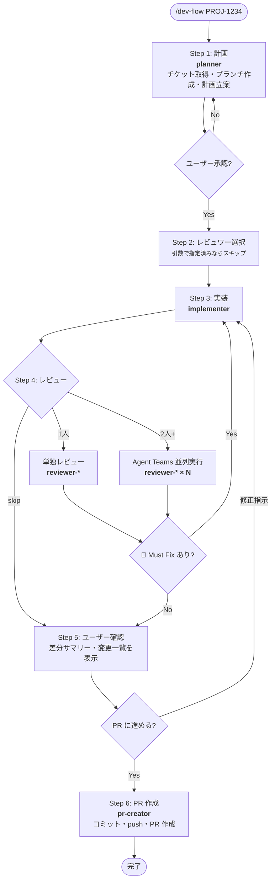
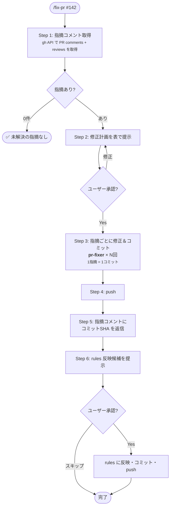
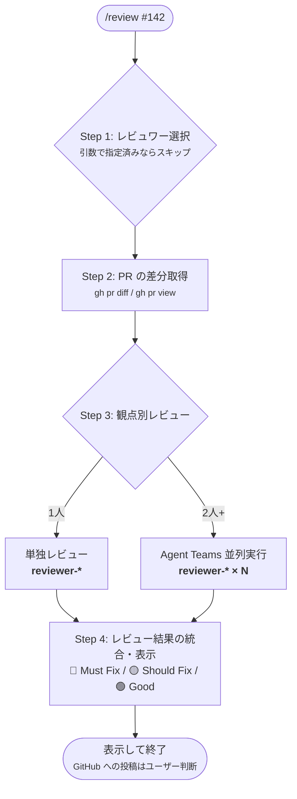
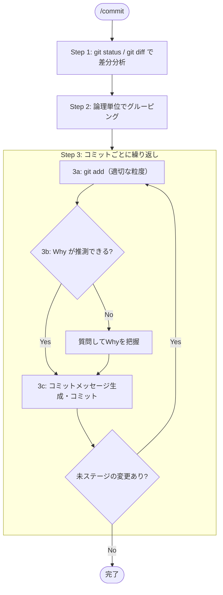
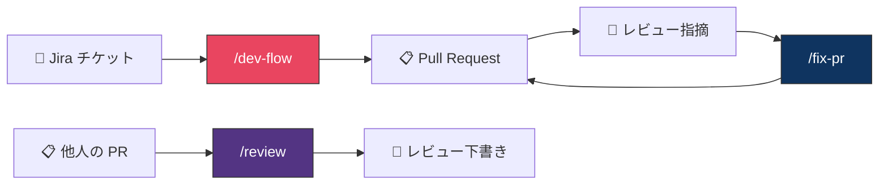
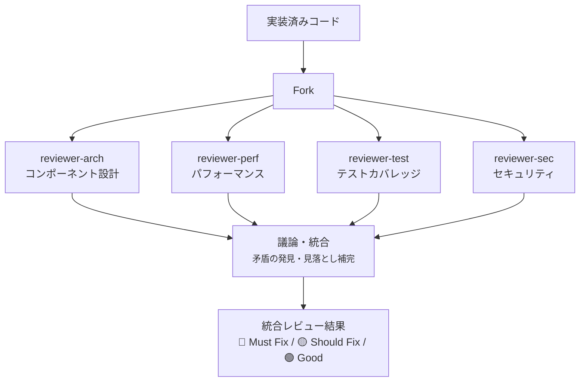

# ai-playground

Claude Code の設定・エージェント・スキルをまとめたプレイグラウンド。

---

## 全体像

### スキルとエージェントの関係

スキル（ユーザーが呼ぶワークフロー）がエージェント（専門家）を組み合わせて処理する構造。



### エージェント一覧

| エージェント | モデル | 役割 | 使えるツール |
|---|---|---|---|
| planner | Opus | チケット取得・ブランチ作成・実装計画 | Read, Grep, Glob, Bash, Atlassian MCP |
| implementer | Opus | 計画に基づくコード実装 | Read, Write, Edit, Bash, Glob, Grep |
| reviewer-arch | Sonnet | コンポーネント設計・Next.js ベストプラクティス | Read, Grep, Glob |
| reviewer-perf | Sonnet | 再レンダリング・メモ化・バンドルサイズ | Read, Grep, Glob |
| reviewer-test | Sonnet | テストカバレッジ・ユーザー操作ベース | Read, Grep, Glob |
| reviewer-sec | Sonnet | XSS・認証認可・機密データ露出 | Read, Grep, Glob |
| pr-creator | Sonnet | コミット分割・PR 作成 | Bash, Read |
| pr-fixer | Sonnet | レビュー指摘の最小修正（1指摘=1コミット） | Read, Write, Bash, Grep, Glob |

---

## できること

### `/dev-flow` — チケットから PR まで一気通貫

Jira チケット番号を渡すだけで、計画・実装・レビュー・PR 作成までを自動で進める。

```
/dev-flow PROJ-1234
/dev-flow PROJ-1234 from develop
/dev-flow PROJ-1234 review:arch,sec
/dev-flow PROJ-1234 review:skip
```

**フロー**



**レビュワーの選び方**

引数なしで実行すると、計画承認後にメニューが出る。番号を打つだけで選択できる。

```
番号 or all / skip で選んでください：
 1. arch — コンポーネント設計・Next.js
 2. perf — パフォーマンス
 3. test — テストカバレッジ
 4. sec  — セキュリティ
 5. all  — 全員
 6. skip — レビューなし
```

2人以上を選ぶと Agent Teams で並列レビューが走る。レビュワー同士が互いの指摘に対して議論し、矛盾や見落としを潰し合う。

---

### `/fix-pr` — PR レビュー指摘の一括修正

PR のレビューコメントを取得し、指摘ごとに修正・コミット・push まで自動で行う。対応後は rules にも反映する。

```
/fix-pr
/fix-pr 142
/fix-pr #142
```

**フロー**



`/dev-flow` で PR を作成し、レビューが返ってきたら `/fix-pr` で対応する流れ。

---

### `/review` — 他人の PR をレビュー

PR の差分を取得し、選択した観点でレビューコメントの下書きを生成する。

```
/review 142
/review #142 review:arch,sec
```

**フロー**



---

### `/commit` — スマートコミット

差分を分析し、適切な粒度でコミットを作成する。変更の「Why」をセッション履歴から推測し、不明なら質問する。



---

### `/component-template` — React コンポーネントの雛形生成

「コンポーネント作って」「画面作って」と指示すると、プロジェクト規約（Functional Component / interface / MUI styled）に沿った雛形とテストファイルをセットで生成する。

---

### `/pr-template` — PR 本文の生成

PR 本文を規定フォーマット（概要 / 対応チケット / 変更内容 / 確認方法 / スクリーンショット）で生成する。`/dev-flow` 内でも自動的に使われる。

---

## 開発ライフサイクル

スキル同士がどう繋がるかの全体図。



---

## 並列レビューの仕組み

レビュワーを2人以上選んだ場合、Agent Teams で並列実行する。



**コスト管理**: レビュワーはメンバー数分のトークンを消費する。用途に応じて選択する。

| シーン                       | 推奨                   |
| ---------------------------- | ---------------------- |
| 小さい修正・typo             | `review:skip`          |
| 通常の機能追加               | `review:arch`          |
| パフォーマンスが気になる変更 | `review:arch,perf`     |
| 認証・権限まわり             | `review:arch,sec,test` |
| 大きなリファクタ             | `review:all`           |

---

## ファイル構成

```
.claude/
├── CLAUDE.md                        # プロジェクト概要・ルールの入口
├── rules/
│   ├── coding-conventions.md        # コンポーネント設計・MUI・Redux 規約
│   ├── git-conventions.md           # Conventional Commits・ブランチ命名
│   └── testing-conventions.md      # Jest / RTL テスト規約
├── agents/
│   ├── planner.md                   # 計画エージェント（Opus）
│   ├── implementer.md               # 実装エージェント（Opus）
│   ├── reviewer-arch.md             # レビュワー: コンポーネント設計・Next.js
│   ├── reviewer-perf.md             # レビュワー: パフォーマンス
│   ├── reviewer-test.md             # レビュワー: テストカバレッジ・品質
│   ├── reviewer-sec.md              # レビュワー: セキュリティ
│   ├── pr-creator.md                # PR 作成エージェント（Sonnet）
│   └── pr-fixer.md                  # PR 指摘修正エージェント（Sonnet）
├── skills/
│   ├── dev-flow/SKILL.md            # /dev-flow スキル
│   ├── fix-pr/SKILL.md             # /fix-pr スキル
│   ├── review/SKILL.md             # /review スキル
│   ├── commit/SKILL.md             # /commit スキル
│   ├── component-template/SKILL.md  # /component-template スキル
│   └── pr-template/SKILL.md        # /pr-template スキル
└── settings.json                    # TypeScript チェックの自動実行フック
```

---

## 設計の考え方

**エージェントとスキルの使い分け**

- **スキル**（`/dev-flow` など）: ユーザーが直接呼ぶワークフロー。フロー制御だけを書く。
- **エージェント**（`planner` など）: スキルから呼ばれる専門家。役割ごとに分離することで、コンテキストの混濁と指示の希薄化を防ぐ。

**並列レビューの仕組み**

レビュワーを2人以上選んだ場合、Claude Code の Agent Teams 機能で並列実行する。各レビュワーは独立したコンテキストを持ち、互いの発見を共有・議論してからリーダーが統合する。1人のレビュワーでは起きない「観点間の矛盾の発見」が可能になる。
